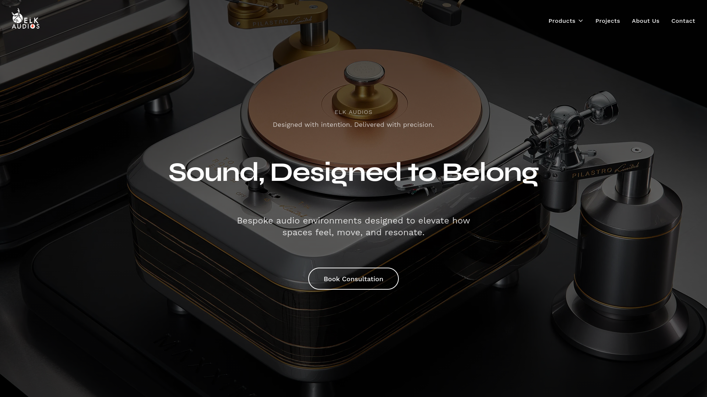
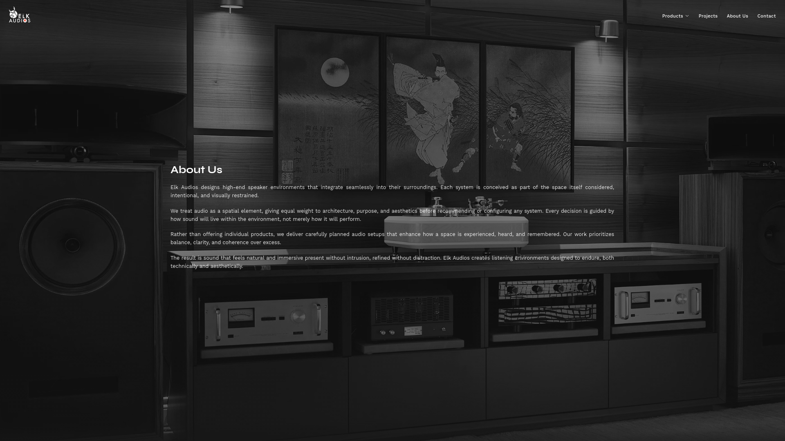
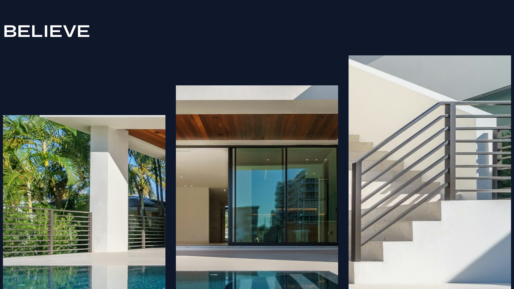
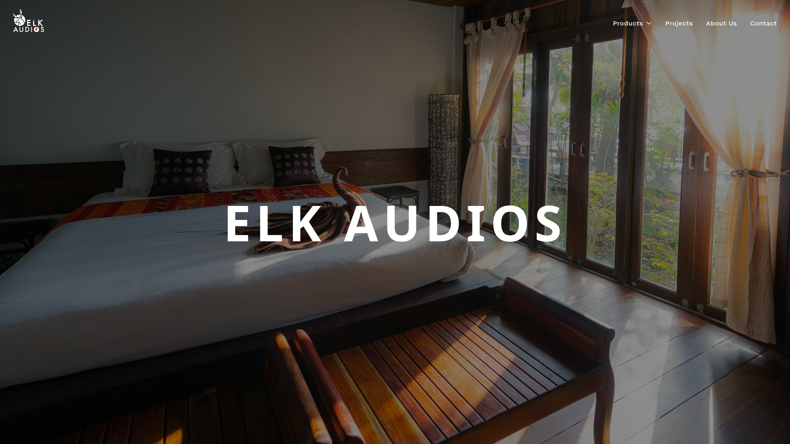
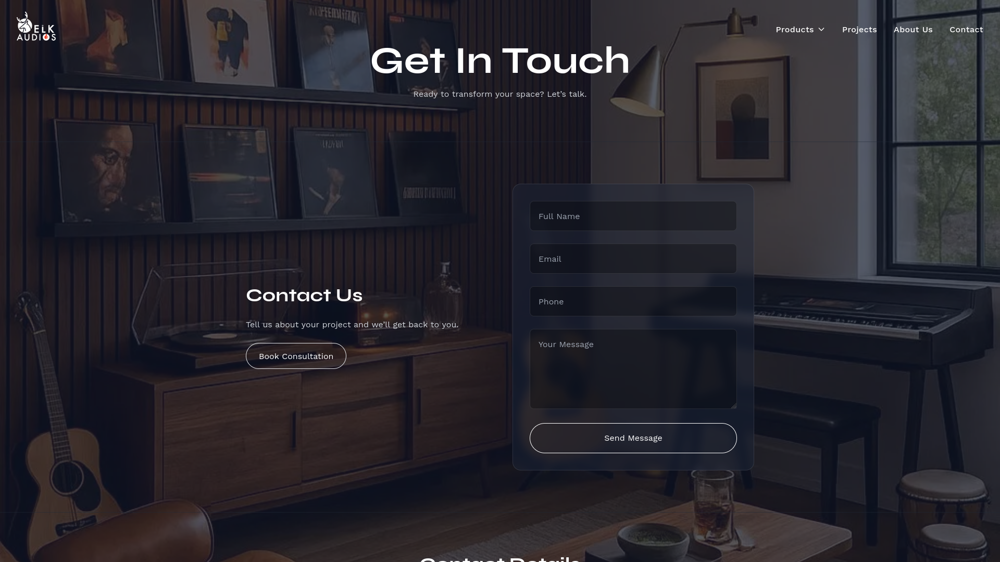

# Elk Audios

> A modern, interactive web experience for Elk Audios, focused on premium audio environments, architectural integration, lifestyle listening, professional AV, and commercial audio solutions.

[](https://elk-audios-nine.vercel.app/)
[](https://nextjs.org/)
[](https://www.typescriptlang.org/)
[](https://tailwindcss.com/)
[](https://react.dev/)

---

## Overview

**Elk Audios** is a full-stack Next.js web application created for a premium audio brand.

The project is designed around the idea that audio should be treated as part of the environment rather than as an isolated product.

The website presents audio solutions across residential, lifestyle, professional AV, and commercial spaces through immersive visual storytelling, responsive layouts, animation, interactive navigation, dedicated solution pages, and contact/inquiry handling.

The application combines:

- immersive full-screen visual sections
- interactive category experiences
- dedicated solution pages
- parallax and scroll-based interactions
- responsive navigation
- contact/inquiry handling
- reusable React components
- server-side API handling
- Google Sheets integration for contact submissions
- responsive and mobile-aware layouts

The application is deployed on Vercel.

**Live Demo:**  
https://elk-audios-nine.vercel.app/

**Repository:**  
https://github.com/Prakhar-Sahu26/ELK-audios

---

# Product Concept

Elk Audios focuses on designing high-end audio environments that integrate with the spaces in which they are installed.

The application communicates this through four major solution categories:

| Solution | Purpose |
|---|---|
| **Home Audio Systems** | Purpose-built speaker and home cinema environments |
| **Lifestyle Audio Solutions** | Design-oriented audio systems for modern living spaces |
| **Professional AV Systems** | Audio-visual environments for professional applications |
| **Commercial Audio Installations** | Strategic sound solutions for commercial spaces |

The category experience uses large visual panels and sticky full-screen sections to create an immersive browsing experience.

---

# Product Experience

## 1. Landing Experience

The home page combines a full-screen hero experience with:

- animated navigation
- branded imagery
- introductory company information
- solution categories
- project/showcase content
- preloader-driven interactions

### Home



---

## 2. About Us

The About page presents Elk Audios as a company focused on integrating audio systems into architecture and interior environments.

The page uses a full-screen visual background with scroll-driven behavior. As the user scrolls, the background changes scale, blur, and opacity to transition the visual focus toward the content.

### About



---

## 3. Solution Categories

The category experience is built around four full-screen sticky sections.

Each category uses a large background image, overlay treatment, centered typography, and navigation into a dedicated solution page.

- Home Audio Systems
- Lifestyle Audio Solutions
- Professional AV Systems
- Commercial Audio Installations

### Boutique Architectural



### Commercial PAVA / AV



---

## 4. Lifestyle Home Audio

The Lifestyle Home Audio experience is implemented as a multi-section presentation rather than a conventional product grid.

The page is composed from dedicated sections and an exhibition-style hero, creating an editorial/product-showcase experience.

A recorded visual walkthrough is also included in the working project.

### Lifestyle Home Audio

<video src="./public/screenshots/lifestyle-home-audio.mp4" controls width="100%"></video>

[Open the Lifestyle Home Audio video](./public/screenshots/lifestyle-home-audio.mp4)

---

## 5. Boutique Architectural

The Boutique Architectural experience uses dedicated interactive components for:

- parallax gallery behavior
- split-content sections
- layout sections
- scroll-based interactions
- smooth scrolling

The implementation includes custom parallax and horizontal-scroll hooks to control the visual movement of the page.

### Boutique Architectural


---

## 6. Commercial PAVA / AV

The Commercial PAVA / AV page is built as a visual presentation with large imagery, hero treatment, structured information sections, and responsive layouts.

### Commercial PAVA / AV


---

## 7. Contact

The Contact page provides a structured inquiry form with:

- name
- email
- phone
- message
- client-side form handling
- validation
- submission state
- server-side API processing

The contact form submits data to a Next.js API route.

The server validates the submitted fields and uses the Google Sheets API to append the inquiry to a configured spreadsheet.

### Contact



---

# Key Features

### Immersive UI

Full-screen visual sections, large imagery, overlays, typography, and scroll-based transitions create a presentation-oriented experience.

### Interactive Scrolling

The project uses smooth scrolling and scroll-driven interactions in several experiences, including parallax and horizontal movement.

### Responsive Design

The application is designed for desktop, tablet, and mobile screen sizes, with responsive layouts and mobile-specific navigation and interaction behavior.

### Reusable Component Architecture

Major experiences are separated into reusable React components rather than keeping the entire interface inside a single page.

Examples include:

- Hero
- Navigation
- About Us
- Category
- Preloader
- Project components
- Boutique Architectural components
- Lifestyle Home Audio sections

### Dedicated Solution Experiences

Each major audio category has its own page and visual treatment instead of using a single generic template.

### Contact Form Integration

The contact workflow uses a Next.js API route with validation and Google Sheets integration for storing submitted inquiries.

### Visual Motion

The project uses dedicated libraries for animation, smooth scrolling, loading experiences, sliders, and interactive presentation.

---

# Technology Stack

## Frontend

- **Next.js 14**
- **React 18**
- **TypeScript**
- **Tailwind CSS 3**
- **Next/Image**

## Interaction & Animation

- **Framer Motion**
- **Lenis**
- **Swiper**
- **Lottie React**
- **Tabler Icons React**

## Forms & Validation

- **React Hook Form**
- **Zod**

## Integrations & UI Utilities

- **Google APIs / Google Sheets API**
- **Leaflet / React Leaflet**
- **Razorpay** dependency for payment-related functionality

## Development

- ESLint
- PostCSS
- Tailwind CSS
- TypeScript
- Vercel

---

# Architecture

The application follows the Next.js App Router structure.

```text
ELK-audios
│
├── app/
│   ├── page.tsx
│   ├── about/
│   ├── contact/
│   ├── products/
│   │   ├── home-cinema/
│   │   ├── lifestyle-home-audio/
│   │   ├── boutique-architectural/
│   │   └── commercial-pava-av/
│   │
│   └── api/
│       └── contact/
│
├── components/
│   ├── Hero
│   ├── Navigation
│   ├── AboutUs
│   ├── Category
│   ├── Preloader
│   ├── Project components
│   ├── Boutique components
│   └── Lifestyle Home Audio components
│
├── contexts/
│   └── PreloaderContext
│
├── data/
│
├── public/
│   └── assets/
│
├── public/screenshot/
│   ├── home.png
│   ├── about.png
│   ├── boutique-architectural.png
│   ├── commercial-pava-av.png
│   ├── contact.png
│   └── lifestyle-home-audio.mp4
│
├── next.config.js
├── tailwind.config.ts
├── tsconfig.json
└── package.json